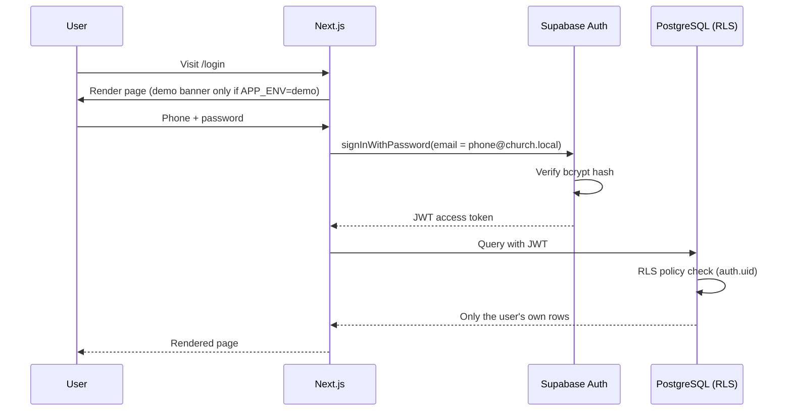
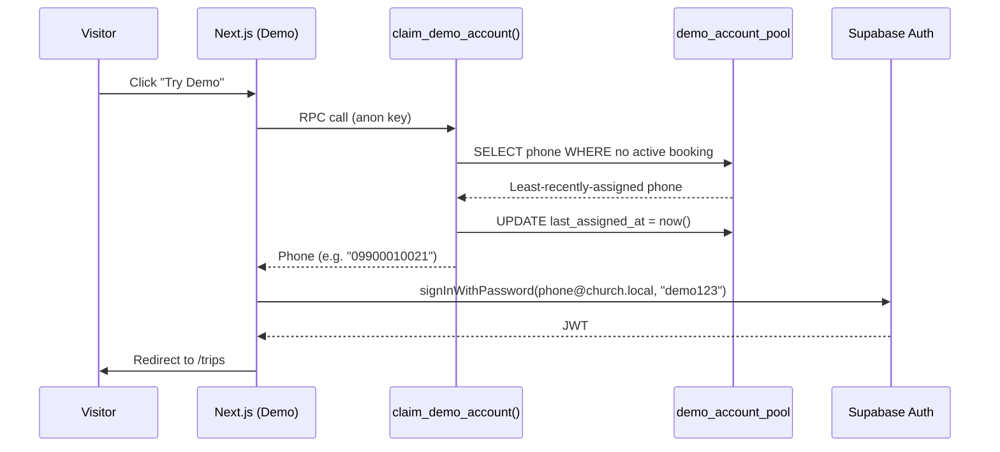
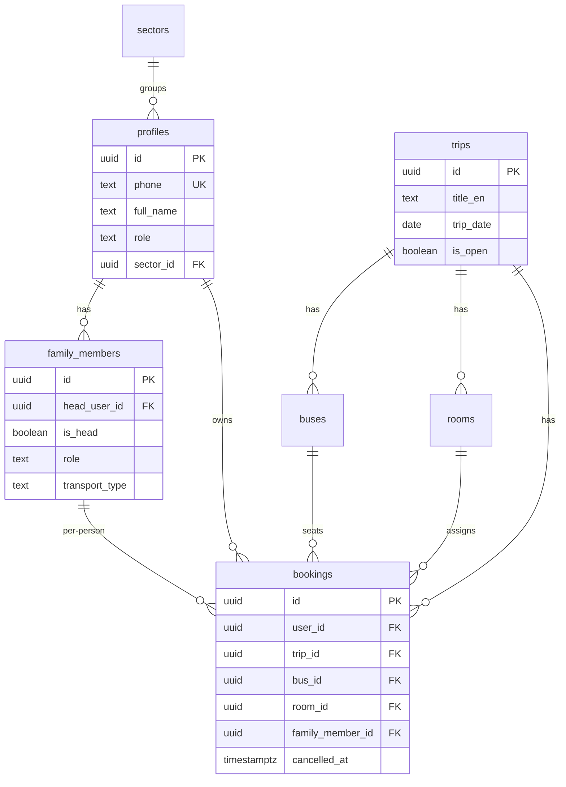
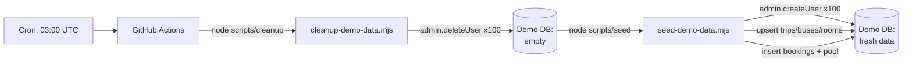

# System Architecture

> How the Booking-Trip System is built, deployed, and kept safe across production and demo environments.

## Overview

```
┌─────────────────────────────────────────────────────────────────┐
│                        GitHub Repository                         │
│                            (main)                                │
└──────┬───────────────────────────────────────┬──────────────────┘
       │                                       │
       │ auto-deploy                           │ cron 03:00 UTC
       ▼                                       ▼
┌─────────────────┐                    ┌──────────────────┐
│  Vercel: Prod   │                    │  GitHub Actions  │
│  APP_ENV=prod   │                    │  Nightly Reset   │
└────────┬────────┘                    └────────┬─────────┘
         │                                      │
         │           ┌─────────────────┐        │ cleanup + seed
         │           │  Vercel: Demo   │        │ (admin API)
         │           │  APP_ENV=demo   │        │
         │           └────────┬────────┘        │
         │                    │                 │
         ▼                    ▼                 ▼
┌──────────────────────────────────────────────────────────────────┐
│              Supabase: Production            Supabase: Demo       │
│              200+ real users                 100 fictional users  │
│              (private)                       (reset nightly)      │
└──────────────────────────────────────────────────────────────────┘
```

**One codebase, two environments.** Selected at build time by `NEXT_PUBLIC_APP_ENV`:

| Environment | Purpose | Database | Accounts |
|---|---|---|---|
| **Production** | Real church members | Live Supabase project | 200+ real users (private) |
| **Demo** | Public showcase | Isolated demo Supabase project | 100 fictional users, reset nightly |

Default (env var unset) = production. There is no runtime switch — the variable is inlined into the JavaScript bundle at build time, so the demo UI is literally stripped from the production build.

---

## Request Flow (Authentication + Data)



**Key security properties:**

- Passwords hashed with bcrypt (`crypt(pw, gen_salt('bf'))`)
- JWT stored in HttpOnly cookie (not accessible to JS)
- Every table has Row Level Security enabled
- Patients can only SELECT/INSERT their own bookings; admins pass an `is_admin()` check
- No user enumeration (login errors are generic)

---

## "Try Demo" Flow (Demo Only)

When a visitor clicks **Try Demo** on the demo site:



**Why round-robin:** Each visitor gets a distinct fictional account (via `FOR UPDATE SKIP LOCKED`), so concurrent visitors don't share sessions or collide on bookings.

**Why prefer unbooked:** 40 of the 100 demo accounts have pre-seeded bookings (makes the demo look alive). `claim_demo_account` skips them first so new visitors can book fresh, then falls back to booked accounts once all 60 unbooked are taken.

---

## Data Model



**Key design choices:**

- **Head-as-member model (post-00101):** the account owner is a `family_members` row with `is_head=true`. Bookings target `family_member_id`, so a head + 2 relatives = 3 booking rows. This unifies the booking path.
- **Soft delete:** bookings use `cancelled_at` (nullable); profiles use `deleted_at`. Queries filter on these.
- **Two partial unique indexes** prevent double-booking: one head booking per trip, one booking per family member per trip.

---

## Nightly Demo Reset (CI/CD)



| Step | Script | What it does | Time |
|---|---|---|---|
| 1 | `scripts/cleanup-demo-data.mjs` | Delete demo trips (cascade), delete 100 auth users via admin API, truncate pool | ~23s |
| 2 | `scripts/seed-demo-data.mjs` | Create 100 users via `admin.createUser()` (auth.identities + profile + family_member auto-created by trigger), upsert 2 trips / 8 buses / 10 rooms, insert 40 bookings, populate pool | ~25s |

**Why Node.js (not SQL):** `supabase.auth.admin.createUser()` is the only supported way to create users — it populates `auth.users` + `auth.identities` together and fires the signup trigger. Direct SQL inserts skip `auth.identities`, which newer Supabase requires for sign-in.

**Manual trigger:** Repo → Actions → "Nightly demo reset" → "Run workflow". Useful before demos when you want fresh data immediately.

---

## Production Safety Guarantees

The nightly reset can **never** touch production:

1. **Separate credentials** — the Action only has `SUPABASE_DEMO_URL` + `SUPABASE_DEMO_SERVICE_ROLE_KEY` secrets (demo project). No production credentials exist in GitHub.
2. **Marker-based targeting** — scripts identify demo data by `phone LIKE '099%'`, `title_en LIKE '[DEMO]%'`, and UUID prefixes (`a1000000-…`, `d0000000-…`). These markers don't exist in production.
3. **Build-time gating** — `isDemo` is `false` in the production bundle. The Try Demo button, demo banner, and read-only settings guards are dead code in production.
4. **Fail-closed default** — if `NEXT_PUBLIC_APP_ENV` is unset, the code defaults to production. Misconfiguration makes the demo invisible, never the reverse.

---

## Tech Stack

| Layer | Technology | Notes |
|---|---|---|
| Framework | Next.js 14 (App Router) | Server-rendered + client components |
| Language | TypeScript | Strict mode |
| Styling | Tailwind CSS | + shadcn/ui primitives |
| Database | Supabase (PostgreSQL) | RLS on every table |
| Auth | Supabase Auth (email) | Email format: `{phone}@church.local` — phone is the real identifier |
| Edge Functions | Supabase Edge (Deno) | PDF report generation |
| Analytics | Vercel Analytics | Privacy-friendly |
| Testing | Jest + React Testing Library | 100 tests |
| CI | GitHub Actions | Lint + test on push/PR; nightly demo reset |
| Deployment | Vercel | Two projects from one repo |

---

## Related Documentation

- **[`MAINPLAN.md`](docs/superpowers/MAINPLAN.md)** — Full project history, phase-by-phase (15 phases)
- **[`demoplan.md`](demoplan.md)** — Demo environment implementation checklist
- **[`README.md`](README.md)** — Quick start, features, badges
- **[`supabase/schema.sql`](supabase/schema.sql)** — Consolidated idempotent schema (single-file install)
